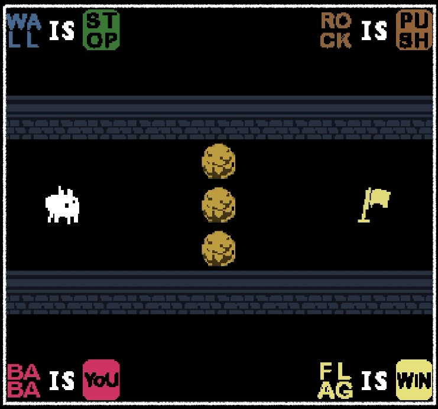
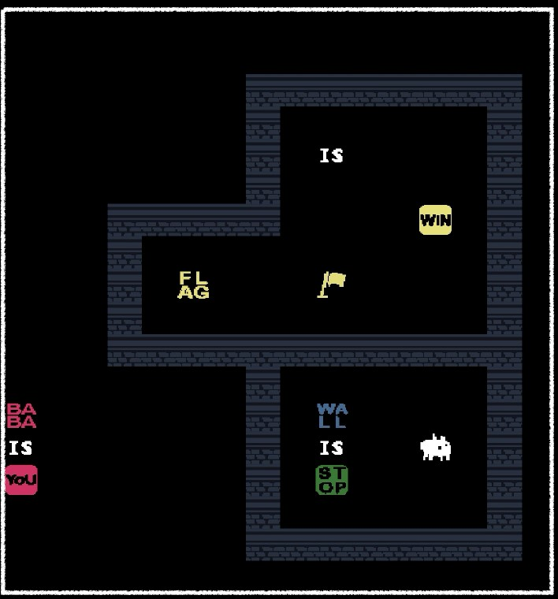

# PD109-1_Baba_Is_You

Try to build the famous game on Steam "Baba is You" via C++ ! 

(But we only made 2 level. More functions are to be developed)

The map of the game is written as into txt file.

Check the presentaion.pdf for more imformation about the object pointers structure and some function pseudo code (and cute Baba as well). 

### Demo ###

- A presentation video with my family (to share with someone with non-engineering background): https://youtu.be/HzAWiKOD7bA?si=Ai3d8OXrPNCJS9mb

